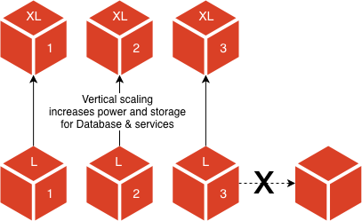

# 擴充架構

雲端基礎結構會根據您的資源需求進行擴充，以實現更高的效率。 雲端基礎結構上的Adobe Commerce會監視您的應用程式，並可調整容量以維持穩定、可預測的效能。 轉換至此架構有助於緩解問題，例如延遲或流量激增。

>[!NOTE]
>
>此擴充架構適用於Pro 48叢集或更高版本的雲端基礎結構帳戶上的Adobe Commerce。

## 分割層架構

過去，Pro架構由三個節點組成，每個節點都包含完整的技術棧疊。 現在，有可擴充的基礎架構，提供至少六個節點的階層式架構：三個節點用於核心資料庫和服務，三個節點用於Web伺服器。 此分割層架構提供獨立擴充分層的功能，以達到效能的最佳平衡。

### 服務層

資料儲存、快取和服務有三個服務節點： **OpenSearch**&#x200B;或&#x200B;**Elasticsearch**、**MariaDB**、**Redis**&#x200B;等等。 當服務層級接近容量時，擴充的唯一方法是增加伺服器大小，例如增加CPU的電源和記憶體。 容量受限於可用節點的大小。 由於資料庫叢集的設計是提供高可用性，因此您無法使用所使用的技術來以可靠的方式水準擴展。



假設服務節點執行個體型別為&#x200B;_m5.2xlarge_，含32-Gb RAM。 服務（例如資料庫）會使用大量的記憶體(30 Gb)。 擴充至下一個可用的執行個體大小&#x200B;_m5.4xlarge_&#x200B;可提供64-Gb RAM，將記憶體加倍，並因應不斷成長的資料庫需求。

您可以根據節點型別路由流量，進一步最佳化服務層的效能。 依預設，資料庫節點會與Web流量隔離。 例如，您可以選擇在資料庫節點上提供Web流量。

### 網頁層

有三個用於處理要求與網路流量的網路節點： **php-fpm**&#x200B;與&#x200B;**NGINX**。 除了透過增加電源和記憶體進行垂直縮放之外，當Web層在PHP層級受到限制時，還可以透過將Web伺服器新增到現有叢集來水平縮放。 請參閱[自動縮放](autoscaling.md)，瞭解網頁節點如何自動縮放。


這補充了服務層級所提供的垂直擴充功能。 隨著服務層級在規模和能力上擴展以適應不斷增長的資料庫和服務使用，Web層級在規模、能力和執行個體上擴展以適應流程請求的增加和更高的流量要求。

假設一個Web節點執行個體型別為&#x200B;_C5.2xlarge，具有八個CPU和16-Gb RAM_。 對網站的請求數大幅增加。 您可以新增C5.2xlarge節點來處理php-fpm處理序的增加，也可以將每個執行個體型別變更為&#x200B;_C5.4xlarge (具有16個CPU和32-Gb RAM_)。 新增節點可減少浪湧容量不足的風險。

## 專案結構

Pro專案中採用「可擴充」架構時，最少會有6個節點可供使用。

- 3個Web節點c5.2xlarge (8個CPU、16-Gb RAM)

- 3個服務節點m5.2xlarge (8個CPU、32Gb RAM)

然而，每個專案都是獨一無二的，需要效能監控才能正確分析資源管理。 每個帳戶都包含[New Relic服務](../monitor/new-relic-service.md)，該服務會自動與應用程式資料和效能分析連線，以提供動態伺服器監視。 具體來說，您可以使用New Relic服務來監視CPU和RAM使用率，以判斷哪些節點需要其他資源。 當資源達到容量或您注意到根據分析的效能降低時，您可以建立請求來擴展您的基礎架構以滿足需求。

### SSH存取

某些檔案和記錄檔（例如`/app/<project-id>/var/log`目錄）不會在節點之間共用。 每個節點都有獨特的SSH存取權。 您無法使用`magento-cloud` CLI登入服務或Web節點，但可以在[!DNL Cloud Console]的SSH存取清單中找到節點位址。

```bash
ssh <node>.<project-ID>-<environment>-<user-ID>@ssh.<region>.magento.com
```

- `node` 1到3 — 存取服務節點的地址

- `node` 4到&#x200B;_n_ — 存取網頁節點的地址

>[!TIP]
>
>登入後，您可以確認伺服器識別碼和角色：服務節點使用&#x200B;_統一_&#x200B;角色，而網頁節點使用&#x200B;_網頁_&#x200B;角色。

您登入&#x200B;**服務節點**&#x200B;時的範例回應包括&#x200B;_統一_&#x200B;角色：

```
 __  __                   _          ___ _             _
|  \/  |__ _ __ _ ___ _ _| |_ ___   / __| |___ _  _ __| |
| |\/| / _` / _` / -_) ' \  _/ _ \ | (__| / _ \ || / _` |
|_|  |_\__,_\__, \___|_||_\__\___/  \___|_\___/\_,_\__,_|
            |___/

 Welcome to Magento Cloud.

 This is server unique-server-id, role project-id:unified.

project-id@server-id:~$
```

您登入&#x200B;**網頁節點**&#x200B;時的範例回應包括&#x200B;_網頁_&#x200B;角色：

```
 __  __                   _          ___ _             _
|  \/  |__ _ __ _ ___ _ _| |_ ___   / __| |___ _  _ __| |
| |\/| / _` / _` / -_) ' \  _/ _ \ | (__| / _ \ || / _` |
|_|  |_\__,_\__, \___|_||_\__\___/  \___|_\___/\_,_\__,_|
            |___/

 Welcome to Magento Cloud.

 This is server unique-server-id, role project-id:web.

project-id@server-id:~$
```

### 記錄位置

記錄位置會依節點而略有不同。 例如，資料庫記錄檔，例如&#x200B;**MySQL錯誤記錄檔**，可在服務節點(`/var/log/mysql/mysql-error.log`)上使用，但無法在Web節點上使用。

每個Pro帳戶都包含[New Relic記錄檔服務](../monitor/new-relic-service.md)，該服務會自動與來自應用程式的記錄檔資料連線，以提供動態記錄檔管理。 來自所有節點的彙總記錄檔資料會顯示在New Relic記錄檔應用程式中，這樣您就可以在單一控制面板上疑難排解特定節點的效能問題。
