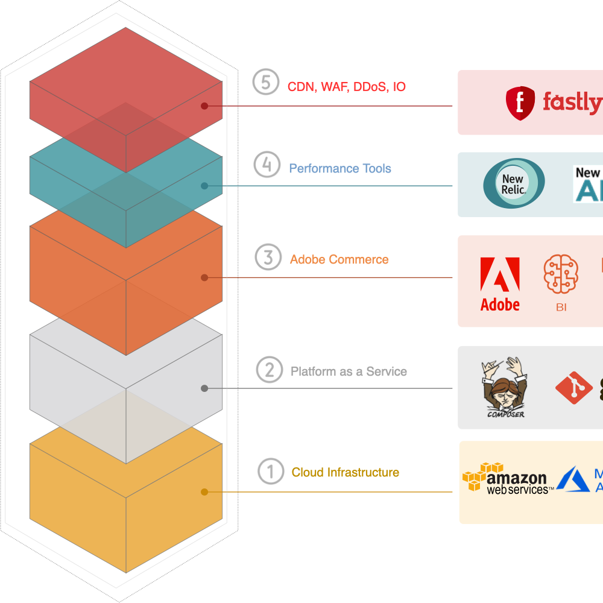

# 技術棧疊

將雲端基礎結構上的Adobe Commerce想成五個功能層，如下所示：

1. [**雲端基礎結構**](pro-architecture.md)：在雲端基礎結構Pro專案上，選擇Amazon Web Services (AWS)或Microsoft Azure作為您Adobe Commerce的基礎結構(IaaS)基礎。

   Adobe會定期分析您的虛擬運算資源(vCPU)使用量，並自動配置資源以最佳化您的長期使用量，並降低超出年度vCPU日允許量上限的風險。 如果您預期特定期間的網站流量會增加，您必須繼續開啟支援票證，以[要求暫時升級](https://experienceleague.adobe.com/docs/commerce-knowledge-base/kb/how-to/how-to-request-temporary-magento-upsize.html)。

1. [**Platform as a Service**](cloud-architecture.md)：雲端基礎結構專案上的每個Adobe Commerce都提供Platform as a Service (PaaS)整合環境，用於開發、測試和整合服務。
1. [**Adobe Commerce**](../project/overview.md)：雲端基礎結構上的Adobe Commerce提供預先布建的基礎結構，其中包括PHP、MySQL (MariaDB)、Redis、訊息佇列服務（[!DNL RabbitMQ]或[!DNL ActiveMQ]），以及支援的搜尋引擎技術。
1. [**效能工具**](../monitor/new-relic-service.md)： New Relic效能工具可讓您透過收集、分析和顯示雲端基礎結構專案上來自Adobe Commerce的資料，來偵錯、監視和管理您的應用程式和基礎結構。
1. [**內容傳遞網路(CDN)、Web應用程式防火牆([!DNL WAF])和影像最佳化(IO)**](../cdn/fastly.md)：

   * [Fastly CDN](../cdn/fastly.md#ddos-protection) — 提供安全CDN服務，內建防範[!DNL Ping of Death]、[!DNL Smurf]等分散式拒絕服務(DDoS)攻擊，以及其他網際網路控制訊息通訊協定(ICMP)泛濫攻擊。
   * [Web應用程式防火牆(WAF)](../cdn/fastly-waf-service.md)—WAF服務可確保生產環境和WAF原則中Adobe Commerce店面的PCI相容性，這些原則可保護Adobe Commerce Web應用程式不受注入攻擊、惡意輸入、跨網站指令碼、資料匯出、HTTP通訊協定違規，以及其他[[!DNL OWASP] 十大安全性威脅](https://owasp.org/www-project-top-ten/)。
   * [影像最佳化(IO)](../cdn/fastly-image-optimization.md) — 提供即時影像操控和最佳化，以加速影像傳遞並簡化回應式網頁應用程式影像來源集的維護。 Fastly IO可解除安裝影像處理和調整負載大小，讓伺服器得以有效處理訂單和轉換。

整體式應用程式需要大量資源，且難以快速擴充及服務。 透過雲端基礎結構，Commerce客戶可獲得前所未有的SaaS型微服務存取權，這些服務豐富、智慧且效能優異。 請參閱[支援的軟體與服務](cloud-architecture.md#supported-software-and-services)。

使用[Commerce快速入門手冊](../../get-started/overview.md)來設定新的雲端程式，並開始在雲端原生環境中管理您的[!DNL Commerce]應用程式。
