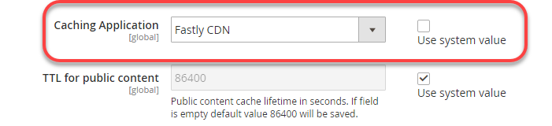

# 設定Fastly服務

雲端基礎結構測試和生產環境上的Adobe Commerce需要Fastly。

Fastly與Varnish合作，提供快速快取功能以及用於靜態資產的內容傳遞網路(CDN)。 Fastly還提供網站應用程式防火牆(WAF)，以保護您的網站和雲端基礎結構。 為了保護您的網站和雲端基礎結構免受惡意流量和攻擊，請透過Fastly路由所有傳入的網站流量。

>[!NOTE]
>
>Fastly在整合環境中不可用。

請完成下列步驟，在網站開發程式早期啟用、設定和測試Fastly，以啟用對網站的安全存取。

- 取得測試和生產環境的Fastly認證
- 啟用Fastly CDN快取
- 上傳Fastly VCL片段
- 更新DNS設定以將流量路由到Fastly服務
- 測試Fastly快取

>[!NOTE]
>
>啟用和驗證初始Fastly設定後，您可以自訂設定。 例如，您可以啟用其他選項，例如影像最佳化、邊緣模組和自訂VCL程式碼。 請參閱[自訂快取組態](fastly-custom-cache-configuration.md)。

在專案布建期間，Adobe會將您的專案新增至雲端基礎結構上Adobe Commerce的[Fastly服務帳戶](fastly.md#fastly-service-account-and-credentials)，並為Starter `master`和Pro測試和生產環境建立Fastly帳戶認證。 每個環境都有獨特的認證。

您需要Fastly認證才能從Adobe Commerce管理員設定Fastly CDN服務並提交Fastly API請求。

## Fastly管理員儀表板存取權

在雲端基礎結構上使用Adobe Commerce，您無法直接存取Fastly管理員儀表板。

您必須使用Adobe Commerce管理員檢閱和更新環境的Fastly設定。 如果您無法在管理員中使用Fastly功能解決問題，請提交[Adobe Commerce支援票證](https://experienceleague.adobe.com/docs/commerce-knowledge-base/kb/help-center-guide/magento-help-center-user-guide.html?lang=zh-Hant#submit-ticket)。

## 取得Fastly認證

使用以下方法為您的環境尋找並儲存Fastly服務ID和API權杖：

**檢視您的Fastly認證**：

>[!NOTE]
>
>請勿在支援票證、公開論壇或任何公開位置共用您的API Token。 此外，永遠不要將API權杖認可給程式碼存放庫 — 存放庫應僅包含沒有敏感資訊的不可變檔案。
>
>Adobe Commerce支援已可存取必要的金鑰，因此您在尋求協助時不需要提供API Token。
>
>如果您的API Token曾公開共用或附加至支援票證，則會視為已洩漏。 在這種情況下，需要Adobe為您產生新的代號。
>
>相關：驗證Fastly認證時發生[錯誤](https://experienceleague.adobe.com/zh-hant/docs/commerce-knowledge-base/kb/troubleshooting/miscellaneous/error-when-validating-fastly-credentials#solution)

Pro和Starter專案的檢視認證方法不同。

- IaaS掛載的共用目錄 — 在Pro專案上，使用SSH連線至您的伺服器並從`/mnt/shared/fastly_tokens.txt`檔案取得Fastly認證。 測試和生產環境都有獨特的認證。 您必須取得每個環境的認證。

- 本機工作區 — 從命令列，使用`magento-cloud` CLI至[清單並檢閱](../environment/variables-cloud.md#viewing-environment-variables) Fastly環境變數。

  ```bash
  magento-cloud variable:get -e <environment-ID>
  ```

- [!DNL Cloud Console] — 檢查[環境組態](../project/overview.md#configure-environment)中的下列環境變數。

   - `CONFIG__DEFAULT__SYSTEM__FULL_PAGE_CACHE__FASTLY__FASTLY_API_KEY`

   - `CONFIG__DEFAULT__SYSTEM__FULL_PAGE_CACHE__FASTLY__FASTLY_SERVICE_ID`

>[!NOTE]
>
>如果您找不到測試或生產環境的Fastly憑證，請聯絡您的Adobe客戶技術顧問(CTA)。

## 啟用Fastly快取

您需要以下元件來啟用和設定Fastly服務：

- 安裝在測試環境和生產環境中的Magento 2模組[&#128279;](fastly.md#fastly-cdn-module-for-magento-2)適用的Fastly CDN最新版本。 請參閱[Fastly升級](#upgrade-the-fastly-module)。

- 雲端基礎結構中繼和生產環境上Adobe Commerce的[Fastly認證](#get-fastly-credentials)

**若要在Staging和Production中啟用Fastly CDN快取**：

{{admin-login-step}}

1. 按一下&#x200B;**存放區** >設定> **組態** > **進階** > **系統**，然後展開&#x200B;**完整頁面快取**。

   

1. 在&#x200B;_快取應用程式_&#x200B;區段中，從&#x200B;**使用系統值**&#x200B;移除選取專案，然後從下拉式清單中選取&#x200B;**Fastly CDN**。

   

1. 展開&#x200B;**Fastly組態**&#x200B;並[選擇快取選項](https://github.com/fastly/fastly-magento2/blob/master/Documentation/CONFIGURATION.md#configure-the-module)。

1. 設定快取選項之後，按一下頁面頂端的&#x200B;**儲存設定**。

1. 根據通知清除快取。

1. 繼續設定Fastly，瀏覽回&#x200B;**商店** > **設定** > **設定** > **進階** > **系統** > **Fastly設定**。

### 測試Fastly認證

1. 在管理員上，瀏覽至&#x200B;**商店** >設定> **設定** > **進階** > **系統** > **快速設定**。

1. 如有需要，請為您的專案環境新增&#x200B;**Fastly服務ID**&#x200B;和&#x200B;**API權杖**&#x200B;值。

   

   >[!NOTE]
   >
   >請勿選取連結來建立Fastly API權杖。 請改用Adobe[&#128279;](#get-fastly-credentials)提供的Fastly認證（服務ID和API權杖）。

1. 按一下&#x200B;**測試認證**。

1. 如果測試成功，請按一下&#x200B;**儲存組態**，然後清除快取。

   如果測試失敗，請確認正確的服務ID和API權杖值符合目前環境的認證。

   如果測試再次失敗，請提交Adobe Commerce支援票證或聯絡您的Adobe客戶代表。 對於Pro專案，請包含生產及測試網站的URL。 對於入門專案，包含您的`Master`和測試網站的URL。

>[!NOTE]
>
>如需為測試或生產環境變更Fastly API權杖認證的指示，請參閱[變更Fastly認證](fastly.md#change-fastly-api-token)。

### 將VCL上傳到Fastly

啟用Fastly模組後，將預設[VCL代碼](https://github.com/fastly/fastly-magento2/tree/master/etc/vcl_snippets)上傳到Fastly伺服器。 此程式碼提供一系列VCL程式碼片段，這些程式碼會指定組態設定，以啟用雲端基礎結構上Adobe Commerce的快取和其他Fastly CDN服務。

>[!NOTE]
>
>在您完成將Fastly VCL程式碼的初始上傳到Adobe Commerce中繼和生產網站之前，Fastly快取服務無法運作。

**若要上傳Fastly VCL**：

1. 在&#x200B;_Fastly組態_&#x200B;區段中，按一下&#x200B;**將VCL上傳至Fastly**，如下圖所示。

   

1. 上傳完成後，請根據頁面頂端的通知重新整理快取。

## 布建SSL/TLS憑證

Adobe提供網域驗證讓我們加密SSL/TLS憑證，以提供來自Fastly的安全HTTPS流量。 Adobe為每個Pro生產、測試和入門生產環境提供一個憑證，以保護該環境中的所有網域。 如需所提供憑證的詳細資訊，請參閱雲端基礎結構上Adobe Commerce的[Adobe SSL (TLS)憑證](https://experienceleague.adobe.com/docs/commerce-knowledge-base/kb/how-to/ssl-tls-certificates-for-magento-commerce-cloud-faq.html?lang=zh-Hant)。

>[!NOTE]
>
>您可以提供自己的TLS或SSL憑證，而不使用Adobe提供的Let&#39;s Encrypt憑證。 不過，此程式需要額外的設定和維護工作。 若要選擇此選項，請提交Adobe Commerce支援票證，或與Adobe搭配使用，在雲端基礎結構環境中將自訂的託管憑證新增到您的Adobe Commerce。

若要為Adobe Commerce環境啟用SSL/TLS憑證，Adobe自動化會完成下列步驟：

- 驗證網域擁有權
- 布建Let&#39;s Encrypt SSL/TLS憑證，涵蓋商店的指定頂層和子網域
- 在網站上線時將憑證上傳到雲端環境

此自動化需要您更新網站的DNS設定，以提供網域驗證資訊。 使用下列方法中的&#x200B;**one**：

- **DNS驗證** — 對於已上線的網站，請以指向Fastly服務的CNAME記錄更新您的DNS設定
- **ACME挑戰CNAME記錄** — 使用Adobe針對您環境中的每個網域提供的ACME挑戰CNAME記錄更新您的DNS設定

>[!TIP]
>
>如果您的生產網域未啟用，請使用ACME挑戰CNAME記錄進行網域驗證。 及早將記錄新增至您的DNS設定可讓Adobe在網站啟動之前，以正確的網域布建SSL/TLS憑證。 在啟動至生產環境之前，您必須以Adobe提供的CNAME記錄取代這些預留位置記錄。

網域驗證完成後，Adobe會布建「讓我們加密TLS/SSL」憑證，並將其上傳至即時中繼或生產環境。 此程式最多可能需要12小時的時間。 我們建議您提前幾天完成DNS設定更新，以防止網站開發和網站啟動延遲。

## 使用開發設定更新DNS設定

在初始Fastly設定流程中，您可以使用以下URL來設定和測試Staging和生產環境中的Fastly快取：

- 對於Pro測試與生產：

   - `mcprod.<your-domain>.com`
   - `mcstaging.<your-domain>.com`

- 僅供入門級生產使用：

   - `mcprod.<your-domain>.com`

布建專案後，即可使用這些預設的生產前URL。 `"your-domain"`的值是您在入門流程中指定的網域名稱。

>[!NOTE]
>
>您無法在入門專案上為非生產環境指定自訂網域。

若要將流量從您的商店URL路由到Fastly服務，請更新您的DNS設定。 當您更新設定時，Adobe會自動布建必要的SSL/TLS憑證，並將其上傳至您的雲端環境。 此布建最多可能需要12小時的時間。

>[!NOTE]
>
>當您準備好啟動生產網站時，必須再次更新DNS設定以將您的生產網域指向Fastly服務並完成其他設定任務。 請參閱[啟動檢查清單](../launch/checklist.md)。

**必要條件：**

- 啟用Fastly模組。
- 上傳預設的Fastly VCL程式碼。
- 提供每個環境的頂層和子網域清單給Adobe，或提交Adobe Commerce支援票證。
- 等候確認指定的網域已新增到您的雲端環境。
- 在入門專案中，將網域新增到您的Fastly服務設定。 請參閱[管理網域](fastly-custom-cache-configuration.md#manage-domains)。
- 如需有關更新DNS設定的資訊，請向您的[DNS登入器](https://lookup.icann.org/)查詢您網域服務的正確方法。

**若要更新您用於開發的DNS設定**：

1. 透過新增CNAME記錄： `prod.magentocloud.map.fastly.net`將預生產URL指向Fastly服務，例如：

   | 網域或子網域 | CNAME |
   |---------------------------|----------------------------------|
   | mcprod.your-domain.com | prod.magentocloud.map.fastly.net |
   | mcstaging.your-domain.com | prod.magentocloud.map.fastly.net |

   當CNAME記錄上線時，Adobe會布建憑證並上傳SSL/TLS憑證。

   >[!NOTE]
   >
   >如果您計畫將Apex網域(`your-domain.com`)用於您的生產網站，您必須設定DNS位址記錄（A記錄）以指向Fastly伺服器IP位址。 請參閱[使用生產設定更新DNS設定](../launch/checklist.md#to-update-dns-configuration-for-site-launch)。


1. 新增ACME挑戰CNAME記錄以進行網域驗證和生產SSL/TLS憑證的預先布建，例如：

   | 網域或子網域 | CNAME |
   |-------------------------------------------|-------------------------------------------|
   | _acme-challenge.your-domain.com | 0123456789abcdef.validation.magento.cloud |
   | _acme-challenge.www.your-domain.com | 9573186429stuvwx.validation.magento.com |
   | _acme-challenge.mystore.your-domain.com | 1234567898zxywvu.validation.magento.cloud |
   | _acme-challenge.subdomain.your-domain.com | 1098765743lmnopq.validation.magento.cloud |

   >[!NOTE]
   >
   >此範例中的ACME挑戰記錄為預留位置，目的並非布建您的Adobe Commerce預備和生產網站。 聯絡Adobe以取得您專案的正確ACME挑戰記錄資訊。

   新增CNAME記錄後，Adobe會驗證網域並為環境布建SSL/TLS憑證。 當您更新DNS設定以將流量從這些網域路由到Fastly服務時，Adobe會將憑證上傳到環境。

1. 更新Adobe Commerce基底URL。

   - 使用SSH登入生產環境。

     ```bash
     magento-cloud ssh
     ```

   - 使用Cloud CLI變更商店的基本URL。

     ```bash
     php bin/magento setup:store-config:set --base-url="https://mcstaging.your-domain.com/"
     ```

   >[!NOTE]
   >
   >除了使用Cloud CLI之外，您也可以從[管理員](https://experienceleague.adobe.com/docs/commerce-admin/stores-sales/site-store/store-urls.html?lang=zh-Hant)更新基底URL

1. 重新啟動網頁瀏覽器。

1. 測試您的網站。

## 測試Fastly快取

完成DNS設定變更後，請使用[cURL](https://curl.se/)命令列工具來驗證Fastly快取是否正常運作。

**若要檢查回應標頭**：

1. 在終端機中，使用下列`curl`命令測試您的即時網站URL：

   ```bash
   curl -vo /dev/null -H Fastly-Debug:1 https://<live-URL>
   ```

   如果您尚未設定靜態路由或完成線上站台上網域的DNS設定，請使用繞過DNS名稱解析的`--resolve`旗標。

   ```bash
   curl -vo /dev/null -H Fastly-Debug:1 --resolve <live-URL-hostname>:443:<live-IP-address>
   ```

1. 在回應中，驗證[標頭](fastly-troubleshooting.md#check-cache-hit-and-miss-response-headers)以確保Fastly正常運作。 您應該會在回應中看到下列不重複標題：

   ```http
   < Fastly-Magento-VCL-Uploaded: yes
   < X-Cache: HIT, MISS
   ```

如果標頭沒有正確的值，請參閱[解決回應標頭中發現的錯誤](fastly-troubleshooting.md#curl)以取得疑難排解說明。

## 升級Fastly模組

Fastly更新Magento 2模組的Fastly CDN以解決問題、提高效能並提供新功能。
我們建議您更新測試和生產環境中的Fastly模組至[最新版本](https://github.com/fastly/fastly-magento2/blob/master/VERSION)。

更新模組後，您必須上傳VCL程式碼以將變更套用至Fastly服務組態。

>[!WARNING]
>
> 如果您已使用自訂版本自訂預設的Fastly VCL程式碼，則升級Fastly模組會覆寫您的變更。 如果您已新增具有唯一名稱的自訂VCL片段，則這些變更會在升級過程中保留。 最佳實務是升級測試環境並驗證變更，然後再將變更套用至生產環境。

**若要檢查Magento 2**&#x200B;的Fastly CDN模組版本：

1. 變更至雲端環境的根目錄。

1. 使用Composer檢查安裝的版本。

   ```bash
   composer show *fastly*
   ```

1. 如果未安裝[最新版本](https://github.com/fastly/fastly-magento2/releases)，請完成升級Fastly模組的步驟。

**若要升級Fastly模組**：

1. 在您的本機整合環境中，使用以下模組資訊來[升級Fastly模組](../store/extensions.md#upgrade-an-extension)。

   ```text
   module name: fastly/magento2
   repository: https://github.com/fastly/fastly-magento2.git
   ```

1. 將更新推送至測試環境。

1. 登入您的測試環境的Admin以[上傳VCL代碼](#upload-vcl-to-fastly)。

1. 在Adobe Commerce測試網站上[驗證Fastly服務](fastly-troubleshooting.md#verify-or-debug-fastly-services)。

在測試網站上驗證Fastly服務後，在生產環境中重複升級過程。

>[!TIP]
>
> 如果您的Adobe Commerce環境中遇到Fastly服務問題，請參閱[Adobe Commerce Fastly疑難排解員](https://experienceleague.adobe.com/docs/commerce-knowledge-base/kb/troubleshooting/miscellaneous/magento-fastly-troubleshooter.html?lang=zh-Hant)。
