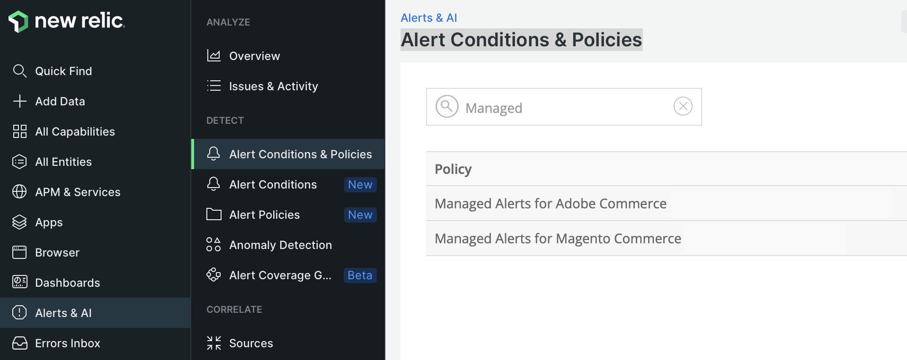

# New Relic監視

New Relic使用PHP代理程式連線並監視您的基礎結構和[!DNL Commerce]應用程式。 雲端環境連線至New Relic後，您可以登入您的New Relic帳戶，檢閱代理程式收集的資料。

在&#x200B;_APM與服務_&#x200B;頁面上，選取&#x200B;**摘要**&#x200B;以檢視應用程式的交易資訊。 此檢視可協助您識別潛在故障，並檢查應用程式和服務的整體健康狀況。

從這個檢視中，您可以追蹤發生緩慢回應或瓶頸的交易、應用程式輸送量、Web錯誤等等。

檢閱追蹤的資料：

- **最耗時** — 透過平行追蹤要求來判斷耗時。 例如，您的產品和類別檢視可能會有花費最多交易時間。 如果客戶帳戶頁面突然在時間消耗上排名很高，您的應用程式可能會受到呼叫或查詢拖曳效能的影響。

- **最高輸送量** — 根據傳輸位元組的大小和頻率，識別點選次數最多的頁面。

所有收集的資料都會詳細說明在傳輸資料、查詢或&#x200B;_Redis_&#x200B;資料的動作上所花費的時間。 如果查詢造成問題，New Relic會提供資訊以追蹤和回應這些問題。

>[!TIP]
>
>如需使用此資料疑難排解應用程式效能問題的詳細資訊，請參閱&#x200B;_Adobe Commerce說明中心_&#x200B;中的[使用New Relic疑難排解效能](https://experienceleague.adobe.com/docs/commerce-knowledge-base/kb/troubleshooting/miscellaneous/troubleshoot-performance-using-new-relic-on-magento-commerce.html?lang=zh-Hant)。

## 使用受管理警示監控效能

Adobe提供Adobe Commerce _警示原則的_&#x200B;受管理警示，以追蹤效能測量結果。 此原則包含警示集合，當基礎結構或應用程式問題影響網站效能時，這些警示會設定臨界值並觸發警告和嚴重通知。 此原則會追蹤生產環境中的以下量度：

| 量度 | 資料彙集 | 可用性 |
|:-------------------|:----------------|:----------------|
| [!DNL Apdex]個分數 | APM | Pro與Starter |
| CPU使用情況 | NRI | Pro |
| 磁碟空間 | NRI | Pro |
| 錯誤率 | APM | Pro與Starter |
| 記憶體使用量 | NRI | Pro |
| MariaDB查詢載入 | NRI | Pro |
| Redis記憶體 | NRI | Pro |

當網站基礎結構或應用程式條件觸發警報臨界值時，New Relic會傳送警報通知，以便您能主動解決問題。 請參閱&#x200B;_Adobe Commerce說明中心_&#x200B;中的[Adobe Commerce受管理警示](https://experienceleague.adobe.com/docs/commerce-knowledge-base/kb/support-tools/managed-alerts/managed-alerts-for-magento-commerce.html?lang=zh-Hant)，以取得警示臨界值和疑難排解步驟的詳細資訊，進而解決觸發警示的問題。

>[!TIP]
>
>對於Pro測試和整合環境以及入門環境，請使用[健康狀態通知](../integrations/health-notifications.md)來監視磁碟空間。

>[!PREREQUISITES]
>
>- **New Relic認證** — 登入雲端專案之New Relic帳戶的認證
>- **作用中New Relic整合** — 確認您的雲端環境已連線至New Relic
>- **工作流程通知** — 設定至少一個[工作流程](#set-up-a-workflow-for-notifications)來接收警示通知

**若要檢閱Adobe Commerce原則的Managed警示**：

1. 登入您的[New Relic帳戶](https://login.newrelic.com/login)。

1. 尋找Adobe Commerce _原則的_&#x200B;受管理警示：

   - 在Explorer導覽功能表中，按一下&#x200B;**[!UICONTROL Alerts & AI]**。

   - 在&#x200B;_偵測_&#x200B;下，按一下&#x200B;**[!UICONTROL Alert Conditions & Policies]**。

   - 確認您的帳戶已選取在&#x200B;_警示條件與原則_&#x200B;檢視的上方。

   - 在&#x200B;_原則_&#x200B;清單中，選取&#x200B;**Adobe Commerce的Managed警示**&#x200B;原則。

     

     >[!NOTE]
     >
     >如果Adobe Commerce _原則的_&#x200B;受管理警示無法使用，請參閱&#x200B;_Adobe Commerce說明中心_&#x200B;中的[Adobe Commerce受管理警示](https://experienceleague.adobe.com/docs/commerce-knowledge-base/kb/support-tools/managed-alerts/managed-alerts-for-magento-commerce.html?lang=zh-Hant)。

1. 按一下&#x200B;**[!UICONTROL Alert conditions]**&#x200B;標籤以檢閱原則中定義的警示條件。

## 建立警示原則

請勿修改「Adobe Commerce的管理警示」原則中包含的任何警示。 Adobe會隨著時間更新並改善此原則中的警示條件，覆寫您新增至原則的任何自訂。

您可以建立警示原則，而不必修改現有的警示。 然後，將警示條件複製到新原則。

>[!TIP]
>
>請參閱&#x200B;_New Relic_&#x200B;檔案中的[警示簡介](https://docs.newrelic.com/docs/alerts/overview/)，以取得有關警示、警示原則和工作流程的詳細資訊。

## 設定通知的工作流程

您現在可以設定&#x200B;_工作流程_ （先前稱為通知通道），以根據篩選的資料（例如警示原則）接收有關您網站績效的通知。 當應用程式或基礎結構的條件觸發警示時，有關效能問題的通知會傳送至與警示原則相關的所有工作流程。 您也會在問題確認和關閉時收到通知。

New Relic提供設定不同型別的工作流程通知的範本，包括電子郵件、Slack、PagerDuty、webhook等。

**若要設定工作流程**：

1. 登入您的[New Relic帳戶](https://login.newrelic.com/login)。

1. 建立工作流程。

   - 在Explorer導覽功能表中，按一下&#x200B;**[!UICONTROL Alerts & AI]**。

   - 在左側導覽的&#x200B;_擴充與通知_&#x200B;下，按一下&#x200B;**[!UICONTROL Workflows]**。

   - 按一下右側的&#x200B;**[!UICONTROL Add a workflow]**。

     

   - 在&#x200B;_設定工作流程_&#x200B;頁面上，輸入工作流程的名稱。

   - 在&#x200B;_篩選資料_&#x200B;區段中，從&#x200B;**[!UICONTROL Policy]**&#x200B;下拉式清單中選取&#x200B;**[!UICONTROL Managed Alerts for Adobe Commerce]**。

   - 在&#x200B;_通知_&#x200B;區段中，選取通道並依照指示進行。

   - 按一下&#x200B;**[!UICONTROL Test workflow]**&#x200B;以驗證您的設定。

1. 按一下&#x200B;**[!UICONTROL Activate workflow]**。

請參閱有關[工作流程](https://docs.newrelic.com/docs/alerts-applied-intelligence/applied-intelligence/incident-workflows/incident-workflows/)的New Relic檔案。

>[!WARNING]
>
>「Adobe Commerce的管理警示」原則中的警示已將預設工作流程設定為通知雲端基礎結構客戶上支援Adobe Commerce的Adobe團隊。 請勿修改這些預設頻道的設定，也不要移除指派給這些頻道的警示原則。
