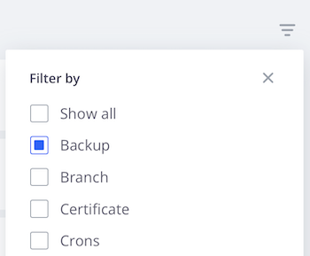

# 活動資料流

每個環境的主要檢視都會顯示類似於Git記錄檔的&#x200B;**活動**&#x200B;歷史事件清單。 活動清單是作用中環境最近事件的資料流。 以下是顯示在「活動」資料流中的活動型別及其圖示清單：

{width="500" align="center"}

## 檢視記錄

在活動清單中，按一下活動的狀態圖示以檢視記錄。 或者，按一下{width="32"} （_更多_）功能表以存取管理活動的更多選項。 以下顯示建立備份的簡短記錄。 您可以[使用Cloud CLI](#activity-stream-with-cloud-cli)檢視相同的記錄。


## 管理活動

部分活動處於&#x200B;_執行_&#x200B;或&#x200B;_擱置_&#x200B;狀態。 您可以在執行中的活動上執行動作，例如取消執行中的部署。 下列標籤顯示取消活動的兩種方法： [!DNL Cloud Console]或Cloud CLI。

>[!BEGINTABS]

>[!TAB 主控台]

**若要取消[!DNL Cloud Console]**&#x200B;中的活動：

您可以存取{width="32"} （_更多_）功能表並選取動作，例如`Cancel`或`View log`，以在執行中的活動上採取行動。 在此範例中，選取&#x200B;**取消**&#x200B;選項以停止執行中的活動。

並非所有活動都有取消選項。 例如，取消應用程式部署的選項只會在&#x200B;_組建_&#x200B;階段中顯示。 應用程式一旦移至&#x200B;_部署_&#x200B;階段，您就無法再取消活動。 檢視關於不同階段的[部署程式](../deploy/process.md)。

{width="450" align="center"}

如果您有終端機執行部署活動，在[!DNL Cloud Console]中取消會導致終端機中的取消：

{width="300"}

>[!TAB CLI]

**若要取消雲端CLI中的活動**：

1. 識別執行中的活動並選取活動ID。

   ```bash
   magento-cloud activity:list --state=in_progress
   ```

1. 使用活動ID取消活動：

   ```bash
   magento-cloud activity:cancel wvl5wm7s5vkhy
   ```

>[!ENDTABS]

## 篩選活動資料流

當您尋找特定專案（例如備份或合併事件）時，篩選活動清單的功能相當實用。

**若要篩選[!DNL Cloud Console]**&#x200B;中的活動清單：

1. 選取環境並選擇[活動&#x200B;**[!UICONTROL All]**]檢視以包含完整的事件歷史記錄。

1. 按一下{width="32"}並選取&#x200B;**[!UICONTROL Filter by]**&#x200B;選項：

   

1. 選擇活動&#x200B;**[!UICONTROL Recent]**&#x200B;檢視並重設清單。

## 使用Cloud CLI檢視資料流

`magento-cloud` CLI提供大部分與[!DNL Cloud Console]相同的功能。 `activity`命令可以：

- `list`環境的活動資料流
- 有關特定活動的`get`詳細資料
- 顯示特定活動的`log`
- `cancel`活動

**若要使用Cloud CLI檢視活動資料流**：

1. 列出目前環境的活動。

   ```bash
   magento-cloud activity:list
   ```

1. 每個活動都有唯一的ID。 從先前的清單中選取ID，並檢視該活動的詳細資訊。

   ```bash
   magento-cloud activity:get wvl5wm7s5vkhy
   ```

1. 檢視該活動的完整記錄。

   ```bash
   magento-cloud activity:log wvl5wm7s5vkhy
   ```

   範例回應：

   ```bash
   Activity ID: wvl5wm7s5vkhy
   Type: environment.backup
   Description: User created a backup of Master
   Created: 2023-09-08T14:03:33+00:00
   State: complete
   Log:
   Creating backup of master
   Created backup eg5pu63egt2dcojkljalzjdopa
   ```
