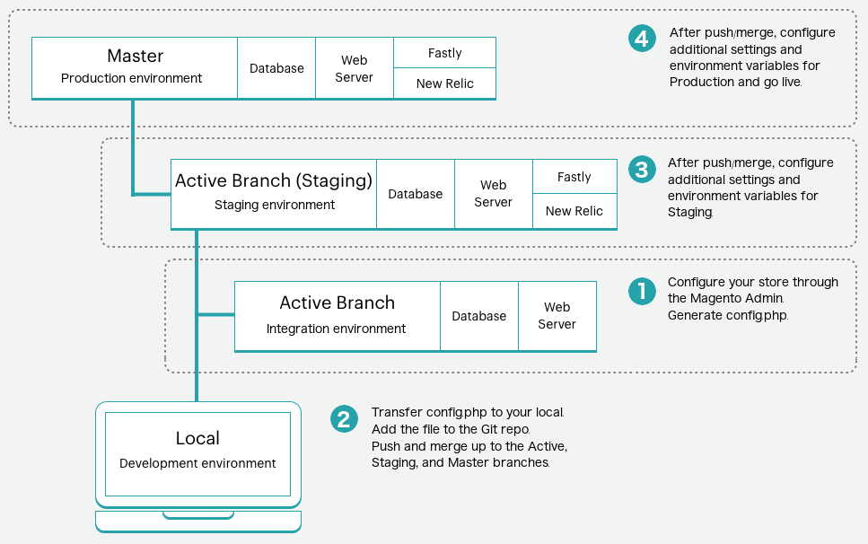

# 存放區設定管理

您存放區的預設設定儲存在適當模組的`config.xml`中。 當您在Commerce管理或CLI `bin/magento config:set`命令中變更設定時，這些變更會反映在核心資料庫中，特別是`core_config_data`表格。 這些設定會覆寫儲存在`config.xml`檔案中的預設組態。

存放區設定參照管理員&#x200B;**存放區** > **設定** > **設定**&#x200B;區段中的設定，根據組態型別儲存在部署組態檔中：

- `app/etc/config.php` — 與靜態內容部署相關的存放區、網站、模組或副檔名、靜態檔案最佳化及系統值的組態設定。 請參閱&#x200B;_組態指南_&#x200B;中的[config.php參考](https://experienceleague.adobe.com/docs/commerce-operations/configuration-guide/files/config-reference-configphp.html)。
- `app/etc/env.php` — 系統特定覆寫的值以及應該將&#x200B;_NOT_&#x200B;儲存在原始檔控制中的敏感設定。 請參閱&#x200B;_組態指南_&#x200B;中的[env.php參考](https://experienceleague.adobe.com/docs/commerce-operations/configuration-guide/files/config-reference-envphp.html)。

>[!NOTE]
>
>由於雲端基礎結構上的Adobe Commerce僅支援生產和維護模式，因此&#x200B;**進階** > **開發人員**&#x200B;區段無法在Admin中存取。 您必須有[環境管理員許可權](../project/user-access.md)才能完成組態管理工作。 您可以使用[環境變數](../environment/configure-env-yaml.md)來設定其他設定。

配置管理提供了一種使用Pipeline部署以最小的停機時間跨環境部署一致商店設定的方法。 雲端基礎結構專案上的Adobe Commerce包括以[管線部署策略](https://experienceleague.adobe.com/docs/commerce-operations/configuration-guide/deployment/technical-details.html)設計的組建伺服器、建置和部署指令碼以及部署環境。

## 設定覆寫配置

所有系統組態均根據下列覆寫配置在建置和部署階段設定：

1. 如果環境變數存在，請使用自訂設定並忽略預設設定。
1. 如果環境變數不存在，請使用[`.magento.app.yaml`檔案](../application/configure-app-yaml.md)中`MAGENTO_CLOUD_RELATIONSHIPS`名稱 — 值組的組態。 忽略預設設定。
1. 如果環境變數不存在且`MAGENTO_CLOUD_RELATIONSHIPS`不包含名稱 — 值組，請移除所有自訂的設定，並使用預設設定中的值。

總而言之，環境變數會覆寫所有其他值。

>[!TIP]
>
>請參閱&#x200B;_設定指南_&#x200B;中的[設定管理](https://experienceleague.adobe.com/docs/commerce-operations/configuration-guide/deployment/technical-details.html)，以取得有關管道部署的覆寫配置的詳細資訊。

如果在多個位置中設定了相同的設定，則應用程式會仰賴下列設定階層來決定要套用至環境的值：

| 優先順序 | 組態<br>方法 | 說明 |
| -------- | ------------------------ | ----------- |
| 1 | [!DNL Cloud Console]<br>環境變數 | 從[!DNL Cloud Console]中環境設定的&#x200B;_變數_&#x200B;索引標籤新增的值。 在此處指定敏感或環境特定設定的值。 無法從管理員編輯此處指定的設定。 請參閱[環境設定變數](../project/overview.md#configure-environment)。 |
| 2 | `.magento.app.yaml` | 已在`.magento.app.yaml`檔案的`variables`區段中新增值。 在此處指定值以確保在所有環境中設定一致。 **請勿在`.magento.app.yaml`檔案中指定敏感值。**&#x200B;檢視[應用程式設定](../application/configure-app-yaml.md)。 |
| 3 | `app/etc/env.php` | 使用`app:config:dump`命令新增儲存於此的環境特定設定值。 使用環境變數或CLI設定系統專屬的敏感值。 檢視[敏感資料](#sensitive-data)。 `env.php`檔案是&#x200B;**不包括在原始檔控制中**。 |
| 4 | `app/etc/config.php` | 使用`app:config:dump`命令新增儲存在此處的值。 共用組態值已新增至`config.php`。 從Admin或使用CLI設定共用設定。 `config.php`檔案包含在原始檔控制中。 |
| 5 | 資料庫 | 透過在Admin中設定設定，可新增此處儲存的值。 使用任何上述方法設定的設定會遭到鎖定（呈現灰色），且無法從Admin進行編輯。 |
| 6 | `config.xml` | 許多組態在`config.xml`檔案中為模組設定了預設值。 如果Adobe Commerce找不到任何由上述方法設定的值，則會回覆為預設值（如果已設定）。 |

{style="table-layout:auto"}

## 設定傾印

您可以使用下列`ece-tools`命令產生包含所有目前存放區設定的`config.php`檔案：

```bash
./vendor/bin/ece-tools config:dump
```

「傾印」至`app/etc/config.php`檔案的資料會變成&#x200B;_鎖定_，這表示Commerce管理員中的對應欄位會變成&#x200B;**唯讀**。 `config.php`檔案僅包含您設定的設定。 它不會鎖定預設值。 僅鎖定您更新的值也可確保中繼和生產環境中使用的所有擴充功能不會因唯讀設定（尤其是Fastly）而中斷。

>[!WARNING]
>
>`ece-tools config:dump`命令無法擷取模組的詳細設定，例如B2B。 如果您需要完整的組態傾印，請使用`app:config:dump`命令，但此命令會將組態值鎖定在唯讀狀態。

### 敏感資料

使用`bin/magento app:config:dump`命令時，任何敏感設定都會匯出至`app/etc/env.php`檔案。 您可以使用CLI命令設定敏感值： `bin/magento config:sensitive:set`。 請參閱&#x200B;_Commerce PHP擴充功能_&#x200B;指南中的[敏感設定和環境特定設定](https://developer.adobe.com/commerce/php/development/configuration/sensitive-environment-settings/)，瞭解如何將組態設定指定為敏感設定或系統特定設定。

請參閱&#x200B;_設定指南_&#x200B;中的[敏感或系統特定設定](https://experienceleague.adobe.com/docs/commerce-operations/configuration-guide/paths/config-reference-sens.html)清單。

### SCD效能

根據存放區的大小，您可能有大量要部署的靜態內容檔案。 通常，當應用程式處於維護模式時，靜態內容會在部署階段進行部署。 最佳設定是在建置階段產生靜態內容。 請參閱[選擇部署策略](../deploy/static-content.md)。

如果您在傾印設定後啟用了「設定管理」，您應該將SCD_*變數從部署階段移至建置階段，以在建置階段正確啟用靜態內容產生。 請參閱[環境變數](../environment/configure-env-yaml.md#environment-variables)。

組態管理前&#x200B;**&#x200B;**：

```yaml
  deploy:
    CRON_CONSUMERS_RUNNER:
      cron_run: true
      consumers: []
    SCD_STRATEGY: compact
    SCD_MATRIX:
      ...
    REDIS_USE_SLAVE_CONNECTION: 1
```

**啟用組態管理之後**：

將SCD_*變數移至建置階段：

```yaml
  deploy:
    CRON_CONSUMERS_RUNNER:
      cron_run: true
      consumers: []
    REDIS_USE_SLAVE_CONNECTION: 1
  build:
    SCD_STRATEGY: compact
    SCD_MATRIX:
      ...
```

>[!NOTE]
>
>在部署靜態檔案之前，建置和部署階段會使用GZIP壓縮靜態內容。 壓縮靜態檔案可減少伺服器負載，並提升網站效能。 請參閱[建置選項](../environment/variables-build.md)，瞭解如何自訂或停用檔案壓縮。

## 管理設定的程式

以下說明此程式的高層級概觀：



**若要設定您的存放區並產生設定檔**：

1. 在管理員中為存放區完成以下環境之一的所有設定：

   - 入門：作用中的開發分支
   - Pro：整合環境中的作用中分支

   這些設定不包含實際產品，除非您計畫將此環境的資料庫轉儲到中繼和生產環境。 通常開發資料庫不包含您的完整存放區資料。

1. 在本機工作站上，變更至專案目錄。

1. 建立遠端資料庫的本機傾印。

   ```bash
   magento-cloud db:dump
   ```

1. 新增、提交和推送程式碼變更以更新遠端環境。

   ```bash
   git add app/etc/config.php
   ```

   ```bash
   git commit -m "Add system-specific configuration"
   ```

   ```bash
   git push origin <branch-name>
   ```

部署完成後，請登入管理員以取得更新的環境以驗證設定。 視需要繼續將任何其他設定合併到測試和生產環境。

### 更新設定

當您透過Admin修改您的環境並再次執行命令時，新設定會附加至`config.php`檔案中的程式碼。

>[!WARNING]
>
>雖然您可以在測試和生產環境中手動編輯`config.php`檔案，但&#x200B;**不建議**。 檔案有助於保持所有環境中的所有設定一致。 永遠不要刪除`config.php`檔案以進行重建。 刪除檔案可以移除建置和部署流程所需的特定配置和設定。

### 還原組態檔

原始`app/etc/env.php`和`app/etc/config.php`檔案的復本是在部署過程中建立的，並儲存在相同的資料夾中。 以下顯示相同`app/etc`資料夾中的BAK （備份檔案）和PHP （原始檔案）：

```
...
config.php.bak
di.xml
env.php.bak
vendor_path.php
config.php
db_schema.xml
env.php
...
```

舊的設定已使用`app/etc/config.local.php`檔案。 請參閱[移轉較舊的組態](#migrate-older-configurations)。

**若要還原組態檔**：

1. 在本機工作站上，使用SSH登入遠端專案和環境。

   ```bash
   magento-cloud ssh
   ```

1. 驗證備份檔案的位置和可用性。

   ```bash
   ./vendor/bin/ece-tools backup:list
   ```

   範例回應：

   ```
   The list of backup files:
   app/etc/env.php
   app/etc/config.php
   ```

1. 還原備份檔案。

   ```bash
   ./vendor/bin/ece-tools backup:restore
   ```

### 移轉較舊的設定

如果您在雲端基礎結構2.2或更新版本上升級至Adobe Commerce，您可能會想要將設定從`config.local.php`檔案移轉至新的`config.php`檔案。 如果管理員中的組態設定符合檔案內容，請依照指示產生並新增`config.php`檔案。

如果兩者不同，您可以將內容從`config.local.php`檔案附加至新的`config.php`檔案：

1. 依照指示產生`config.php`檔案。

1. 開啟`config.php`檔案並刪除最後一行。

1. 開啟`config.local.php`檔案並複製內容。

1. 將內容貼入`config.php`檔案、儲存並完成新增到Git。

1. 跨您的環境部署。

您僅能完成此移轉一次。 移轉之後，請使用`config.php`檔案。

### 變更地區設定

您可以變更商店地區設定，而不需遵循複雜的設定匯入和匯出程式，_如果_&#x200B;您已啟用[SCD_ON_DEMAND](../environment/variables-global.md#scd_on_demand)。 您可以使用「管理員」來更新地區設定。

您可以透過在整合分支中啟用`SCD_ON_DEMAND`，將另一個地區設定新增到測試或生產環境，使用新的地區設定資訊產生更新的`config.php`檔案，並將設定檔案複製到目標環境。

>[!WARNING]
>
>此處理程式&#x200B;**覆寫**&#x200B;存放區組態；只有在環境包含相同的存放區時，才執行下列動作。

1. 在整合環境中，使用[`.magento.env.yaml`檔案](../environment/configure-env-yaml.md)啟用`SCD_ON_DEMAND`變數。

1. 使用您的管理員新增必要的地區設定。

1. 使用SSH登入遠端環境，並產生包含所有地區設定的`/app/etc/config.php`檔案。

   ```bash
   ssh <SSH-URL> "./vendor/bin/ece-tools config:dump"
   ```

1. 將新的設定檔從遠端整合環境複製到本機環境目錄。

   ```bash
   rsync <SSH-URL>:app/etc/config.php ./app/etc/config.php
   ```

1. 新增、提交和推送程式碼變更以更新遠端環境。
