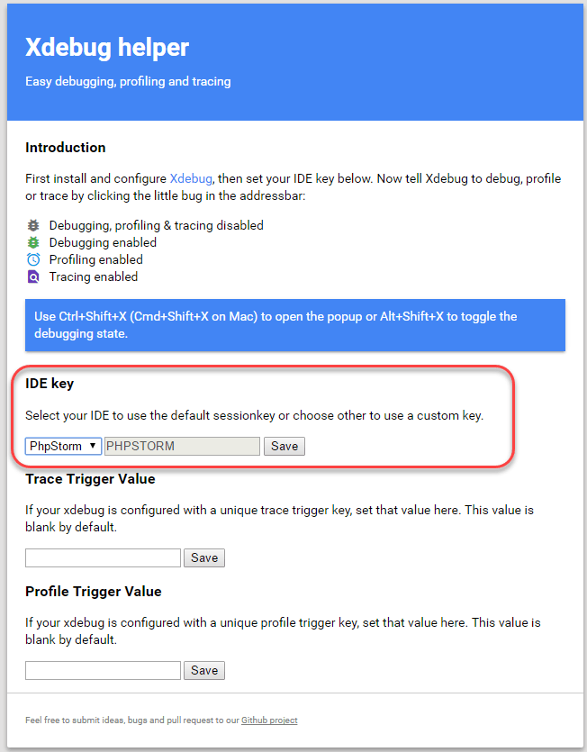

# 設定Xdebug

[!DNL Xdebug]是用於偵錯PHP的擴充功能。 雖然您可以使用您選擇的IDE，以下說明如何設定[!DNL Xdebug]和[!DNL PhpStorm]以在本機環境中除錯。

>[!NOTE]
>
>您可以設定[!DNL Xdebug]在Cloud Docker環境中執行以進行本機偵錯，而不變更雲端基礎結構專案設定上的Adobe Commerce。 請參閱[為Docker](https://developer.adobe.com/commerce/cloud-tools/docker/test/configure-xdebug)設定Xdebug。

若要啟用[!DNL Xdebug]，您必須在Git存放庫中設定檔案、設定IDE，並設定連線埠轉送。 您可以在`magento.app.yaml`檔案中設定一些設定。 編輯之後，跨所有入門環境和Pro整合環境推送Git變更以啟用[!DNL Xdebug]。 [!DNL Xdebug]已在Pro測試和生產環境中可用。

設定之後，您就可以偵錯CLI命令、Web請求和程式碼。 請記住，所有雲端基礎結構環境都是唯讀的。 將程式碼複製到本機開發環境以執行偵錯。 若為Pro測試和生產環境，請參閱[的](#debug-for-pro-staging-and-production)其他指示[!DNL Xdebug]。

## 需求

若要執行並使用[!DNL Xdebug]，您需要環境的SSH URL。 您可以透過[[!DNL Cloud Console]](../project/overview.md)或您的[!DNL Cloud Onboarding UI]尋找資訊。

## 設定Xdebug

若要設定[!DNL Xdebug]，請遵循下列步驟：

- [在分支中工作以推送檔案更新](#get-started-with-a-branch)
- [為環境啟用 [!DNL Xdebug] ](#enable-xdebug-in-your-environment)
- [設定PHPStorm伺服器](#configure-phpstorm-server)
- [設定連線埠轉送](#set-up-port-forwarding)

### 開始使用分支

若要新增[!DNL Xdebug]，Adobe建議使用[開發分支](../dev-tools/cloud-cli-overview.md#create-an-environment-branch)。

### 在您的環境中啟用Xdebug

您可以將[!DNL Xdebug]直接啟用至所有入門環境和Pro整合環境。 Pro生產和中繼環境不需要此設定步驟。 請參閱[Pro Staging和生產的Debug](#debug-for-pro-staging-and-production)。

>[!VIDEO](https://video.tv.adobe.com/v/3437407?learn=on)

若要啟用專案的[!DNL Xdebug]，請新增`xdebug`至`runtime:extensions`檔案的`.magento.app.yaml`區段。

**若要啟用Xdebug**：

1. 在本機終端機中，以文字編輯器開啟`.magento.app.yaml`檔案。

1. 在`runtime`區段的`extensions`下，新增`xdebug`。 例如：

   ```yaml
   runtime:
       extensions:
           - redis
           - xsl
           - newrelic
           - sodium
           - xdebug
   ```

1. 儲存您對`.magento.app.yaml`檔案所做的變更，並結束文字編輯器。

1. 新增、提交和推送變更以重新部署環境。

   ```bash
   git add .magento.app.yaml
   ```

   ```bash
   git commit -m "add xdebug"
   ```

   ```bash
   git push origin <environment-ID>
   ```

部署至入門環境和Pro整合環境時，[!DNL Xdebug]現在可供使用。 繼續設定IDE。 若為PhpStorm，請參閱[設定PhpStorm](#configure-phpstorm)。

### 設定PhpStorm伺服器

>[!VIDEO](https://video.tv.adobe.com/v/3437409?learn=on)

[PhpStorm](https://www.jetbrains.com/phpstorm/) IDE必須設定為可正確搭配[!DNL Xdebug]使用。

**若要設定PhpStorm以搭配Xdebug使用**：

1. 在您的PhpStorm專案中，開啟&#x200B;**設定**&#x200B;面板。

   - _macOS_ — 選取&#x200B;**PhpStorm** > **設定**。
   - _Windows/Linux_ — 選取&#x200B;**檔案** > **設定**。

1. 在&#x200B;_設定_&#x200B;面板中，展開&#x200B;**PHP**&#x200B;區段並按一下&#x200B;**伺服器**。

1. 按一下&#x200B;**+**&#x200B;以新增伺服器組態。 專案名稱在頂端為灰色。

1. [選擇性]為新伺服器組態設定下列設定。 請參閱[PHPStorm](https://www.jetbrains.com/help/phpstorm/troubleshooting-php-debugging.html#no-debug-server-is-configured)檔案中的&#x200B;_未設定偵錯伺服器_。

   - **名稱** — 輸入與主機名稱相同的名稱。 此值必須符合`PHP_IDE_CONFIG`偵錯CLI命令[中](#debug-cli-commands)變數的值，才能使用CLI進行偵錯。
   - **主機** — 輸入主機名稱。
   - **連線埠** — 輸入`443`。
   - **偵錯工具** — 選取`Xdebug`。

1. 選取&#x200B;**使用路徑對應**。 在&#x200B;_檔案/目錄_&#x200B;窗格中，會顯示`serverName`的專案根目錄。

1. 在伺服器&#x200B;**欄的**&#x200B;絕對路徑中，按一下&#x200B;**編輯**&#x200B;圖示，並根據環境新增設定。

   - 對於所有入門環境和Pro整合環境，遠端路徑為`/app`。
   - 對於Pro測試和生產環境：

      - 生產： `/app/<project_code>/`
      - 正在暫存： `/app/<project_code>_stg/`

1. 將[!DNL Xdebug]連線埠變更為`9000,9003`，或者您可以在`9000`PHP **>**&#x200B;偵錯&#x200B;**>** Xdebug **>**&#x200B;偵錯連線埠&#x200B;**面板中將其限製為只有**。

1. 按一下&#x200B;**套用**。

### 建立PHPStorm執行/偵錯組態

這可讓應用程式擁有正確的偵錯設定，以處理來自Adobe Commerce應用程式的請求。

>[!VIDEO](https://video.tv.adobe.com/v/3437426?learn=on)

1. 開啟PHPStorm應用程式，然後按一下畫面右上角的&#x200B;**[!UICONTROL Add Configuration]**。

1. 按一下&#x200B;**[!UICONTROL Add new run configuration]**。

1. 選取&#x200B;**[!UICONTROL PHP Remote Debug]**&#x200B;選項。

   - 輸入唯一但可辨識的名稱。
   - 勾選「[!UICONTROL Filter debug connection by IDE key]**」核取方塊。
   - 選取您在[上一節](#configure-phpstorm-server)中建立的伺服器。 如果您尚未建立，可以現在建立，但請參閱設定指南的該部分。
   - 在&#x200B;**[!UICONTROL IDE key(session id)]**&#x200B;文字欄位中，以大寫字母輸入`PHPSTORM`。 我們會在設定的其他部分使用此專案，因此請務必維持不變。 如果您選擇其他字串，則必須記得在設定和組態程式的其他位置使用它。

1. 按一下&#x200B;**[!UICONTROL Apply]** > **[!UICONTROL OK]**。

### 設定連線埠轉送

>[!VIDEO](https://video.tv.adobe.com/v/3437410?learn=on)

將伺服器的`XDEBUG`連線對應到您的本機系統。 若要執行任何型別的偵錯，您必須將連線埠9000從雲端基礎結構伺服器上的Adobe Commerce轉送至本機電腦。 請參閱下列其中一節：

- [Mac或UNIX上的連線埠轉送](#port-forwarding-on-mac-or-unix)
- [Windows上的連線埠轉送](#port-forwarding-on-windows)

#### Mac或UNIX上的連線埠轉送®

**若要在Mac或UNIX®環境中設定連線埠轉送**：

1. 開啟終端機。

1. 使用SSH建立連線。

   ```bash
   ssh -R 9000:localhost:9000 <ssh url>
   ```

   使用`-v` （詳細資訊）選項，以便每當通訊端連線到轉送的連線埠時，它就會顯示在終端機中。

   如果顯示「無法連線」或「無法接聽遠端連線埠」錯誤，則伺服器上可能持續存在另一個使用中的SSH工作階段，而此工作階段佔用連線埠9000。 如果該連線未使用，您可以終止它。

**若要疑難排解連線**：

1. 使用SSH登入遠端整合、預備或生產環境。

1. 檢視SSH工作階段清單： `who`

1. 依使用者檢視現有的SSH工作階段。 請留意勿影響您以外的使用者！

   - 整合：使用者名稱類似於`dd2q5ct7mhgus`
   - 正在暫存：使用者名稱類似於`dd2q5ct7mhgus_stg`
   - 生產：使用者名稱類似於`dd2q5ct7mhgus`

1. 對於比您更早的使用者工作階段，請尋找虛擬終端機(PTS)值，例如`pts/0`。

1. 終止與PTS值對應的處理序ID (PID)。

   ```bash
   ps aux | grep ssh
   kill <PID>
   ```

   範例回應：

   ```
   dd2q5ct7mhgus        5504  0.0  0.0  82612  3664 ?      S    18:45   0:00 sshd: dd2q5ct7mhgus@pts/0
   ```

   若要終止連線，請輸入包含處理序ID (PID)的kill命令。

   ```bash
   kill 3664
   ```

#### Windows上的連線埠轉送

若要在Windows上設定連線埠轉送（SSH通道），您必須設定Windows終端機應用程式。 此範例會逐步使用[Putty](https://www.chiark.greenend.org.uk/~sgtatham/putty/latest.html)建立SSH通道。 您可以使用Cygwin等其他應用程式。 如需其他應用程式的詳細資訊，請參閱隨這些應用程式提供的廠商檔案。

**若要使用Putty在Windows上設定SSH通道**：

1. 如果您尚未這樣做，請下載[Putty](https://www.chiark.greenend.org.uk/~sgtatham/putty/latest.html)。

1. 啟動Putty。

1. 在[類別]窗格中，按一下[**工作階段**]。

1. 輸入下列資訊：

   - **主機名稱（或IP位址）**&#x200B;欄位：輸入雲端伺服器的[SSH URL](../development/secure-connections.md#connect-to-a-remote-environment)
   - **連線埠**&#x200B;欄位：輸入`22`

   

1. 在&#x200B;_類別_&#x200B;窗格中，按一下&#x200B;**連線** > **SSH** > **通道**。

1. 輸入下列資訊：

   - **Source連線埠**&#x200B;欄位：輸入`9000`
   - **目的地**&#x200B;欄位：輸入`127.0.0.1:9000`
   - 按一下&#x200B;**遠端**

1. 按一下&#x200B;**新增**。

   

1. 在&#x200B;_類別_&#x200B;窗格中，按一下&#x200B;**工作階段**。

1. 在&#x200B;**儲存的工作階段**&#x200B;欄位中，輸入此SSH通道的名稱。

1. 按一下&#x200B;**儲存**。

   

1. 若要測試SSH通道，請按一下[載入]。****，然後按一下[開啟]。****

   如果顯示「無法連線」錯誤，請確認下列事項：

   - 所有Putty設定皆正確
   - 您正在雲端基礎結構上的私人Adobe Commerce SSH金鑰所在的電腦上執行Putty

## 透過SSH存取Xdebug環境

若要起始除錯、執行設定等作業，您需要SSH命令才能存取環境。 您可以透過[[!DNL Cloud Console]](../development/secure-connections.md#use-an-ssh-command)和專案試算表取得此資訊。

對於入門環境和Pro整合環境，您可以使用以下`magento-cloud` CLI命令對這些環境執行SSH連結：

```bash
magento-cloud environment:ssh --pipe -e <environment-ID>
```

若要使用[!DNL Xdebug]，請依照下列方式使用SSH至環境：

```bash
ssh -R <xdebug listen port>:<host>:<xdebug listen port> <SSH-URL>
```

例如，

```bash
ssh -R 9000:localhost:9000 pwga8A0bhuk7o-mybranch@ssh.us.magentosite.cloud
```

## 針對Pro測試和生產進行除錯

>[!NOTE]
>
>在Pro測試與生產環境中，[!DNL Xdebug]一律可用，因為這些環境對[!DNL Xdebug]有特殊設定。 所有一般Web要求都會路由到沒有[!DNL Xdebug]的專用PHP處理序。 因此，這些要求會正常處理，且載入[!DNL Xdebug]時不會發生效能降低的情況。 當傳送具有[!DNL Xdebug]金鑰的Web要求時，它會路由至已載入[!DNL Xdebug]的個別PHP處理序。

若要在Pro計畫測試和生產環境中使用[!DNL Xdebug]，您必須建立單獨的SSH通道和Web工作階段，只有您才有權存取。 此使用方法與一般存取不同，僅提供存取權給您，而非所有使用者。

您需要下列專案：

- 用於存取環境的SSH命令。 您可以透過[[!DNL Cloud Console]](../project/overview.md)或您的[!DNL Cloud Onboarding UI]取得此資訊。
- 設定Staging和Pro環境時所設定的`xdebug_key`值。

  可以使用SSH登入主要節點並執行：`xdebug_key`

  ```bash
  cat /etc/platform/*/nginx.conf | grep xdebug.sock | head -n1
  ```

**若要設定SSH通道至測試或生產環境**：

1. 開啟終端機。

1. 清除叢集之每個Web節點的所有SSH工作階段。

   ```bash
   ssh USERNAME@CLUSTER.ent.magento.cloud 'rm /run/platform/USERNAME/xdebug.sock'
   ```

1. 為叢集的每個Web節點設定Xdebug的SSH通道。

   ```bash
   ssh -R /run/platform/USERNAME/xdebug.sock:localhost:9000 -N USERNAME@CLUSTER.ent.magento.cloud
   ```

>[!NOTE]
>
>若要取得`USERNAME@CLUSTER.ent.magento.cloud`的正確值：
>- 方法1： magento-cloud CLI： `magento-cloud ssh --all`
>- 方法2： Commerce主控台： https://CONSOLE-URL/ENVIRONMENT，按一下`SSH v`下拉式清單

**若要使用環境URL**&#x200B;開始偵錯：

這是用來啟動遠端偵錯工作階段之設定的示範，同時也是GET引數的示範。

>[!VIDEO](https://video.tv.adobe.com/v/3437417?learn=on)

1. 啟用遠端偵錯；造訪瀏覽器中的網站，並將下列專案附加至`KEY`為`xdebug_key`值的URL。

   ```http
   ?XDEBUG_SESSION_START=KEY
   ```

   此步驟會設定傳送瀏覽器請求以觸發[!DNL Xdebug]的Cookie。

1. 使用[!DNL Xdebug]完成偵錯。

1. 當您準備好結束工作階段時，請使用下列命令移除Cookie，並透過瀏覽器結束偵錯，其中`KEY`為`xdebug_key`的值。

   ```http
   ?XDEBUG_SESSION_STOP=KEY
   ```

   >[!NOTE]
   >
   >不支援`XDEBUG_SESSION_START`要求所傳遞的`POST`。

## 偵錯CLI命令

本節逐步解說如何偵錯CLI命令。

若要偵錯CLI命令：

1. 使用CLI命令以連線方式連線至您要偵錯的伺服器。

1. 建立下列環境變數：

   ```bash
   export XDEBUG_CONFIG='PHPSTORM'
   ```

   ```bash
   export PHP_IDE_CONFIG="serverName=<name of the server that is configured in PHPSTORM>"
   ```

   這些變數會在SSH工作階段結束時移除。

1. 開始偵錯

   在入門環境和Pro整合環境中，執行CLI命令以進行偵錯。
您可以新增執行階段選項，例如：

   ```bash
   php -d xdebug.profiler_enable=On -d xdebug.max_nesting_level=9999 bin/magento cache:clean
   ```

   在Pro測試環境和生產環境中，偵錯CLI命令時，您必須指定[!DNL Xdebug] PHP組態檔的路徑，例如：

   ```bash
   php -c /etc/platform/USERNAME/php.xdebug.ini bin/magento cache:clean
   ```

## 偵錯網頁請求

下列步驟可協助您偵錯Web請求。

1. 在&#x200B;_擴充功能_&#x200B;功能表上，按一下&#x200B;**偵錯**&#x200B;以啟用。

1. 按一下滑鼠右鍵，選取選項功能表，並將IDE金鑰設定為&#x200B;**PHPSTORM**。

1. 在瀏覽器上安裝[!DNL Xdebug]使用者端。 設定並啟用它。

### 範例： Chrome設定

本節討論如何使用[!DNL Xdebug] Helper擴充功能在Chrome中使用[!DNL Xdebug]。 如需其他瀏覽器的[!DNL Xdebug]工具的相關資訊，請參閱瀏覽器檔案。

**若要搭配Chrome**&#x200B;使用Xdebug Helper：

1. 建立[SSH通道](#ssh-access-to-xdebug-environments)到雲端伺服器。

1. 從Chrome市集安裝[Xdebug Helper擴充功能](https://chromewebstore.google.com/detail/eadndfjplgieldjbigjakmdgkmoaaaoc)。

1. 在Chrome中啟用此擴充功能，如下圖所示。

   

1. 在Chrome中，以滑鼠右鍵按一下Chrome工具列中的綠色協助程式圖示。

1. 從快顯功能表，按一下&#x200B;**選項**。

1. 從&#x200B;_IDE索引鍵_&#x200B;清單中，按一下&#x200B;**PhpStorm**。

1. 按一下&#x200B;**儲存**。

   

1. 開啟您的PhpStorm專案。

1. 在頂端導覽列中，按一下&#x200B;**開始聆聽**&#x200B;圖示。

   如果未顯示導覽列，請按一下&#x200B;**檢視** > **導覽列**。

1. 在PhpStorm導覽窗格中，連按兩下PHP檔案以進行測試。

## 偵錯本機程式碼

由於是唯讀環境，您必須從環境或特定Git分支將程式碼提取至本機工作站，才能執行偵錯。

您選擇的方法由您決定。 您有以下選項：

- 從Git簽出程式碼並執行`composer install`

  除非`composer.json`參考您無權存取的私人存放庫中的封裝，否則此方法有效。 此方法可取得整個Adobe Commerce程式碼基底。

- 複製`vendor`、`app`、`pub`、`lib`和`setup`目錄

  此方法可讓您的程式碼完全可供測試。 視您擁有的靜態資產數量而定，可能會導致傳輸時間過長，並產生大量檔案。

- 僅複製`vendor`目錄

  因為大部分的程式碼在`vendor`目錄中，所以此方法可能會產生良好的測試，雖然未測試整個程式碼基底。

**若要壓縮檔案並將它們複製到本機電腦**：

1. 使用SSH登入遠端環境。

1. 壓縮檔案。

   ```bash
   tar -czf /tmp/<file-name>.tgz <directory list>
   ```

   例如，只壓縮`vendor`目錄：

   ```bash
   tar -czf /tmp/vendor.tgz vendor
   ```

1. 在您的本機環境中，使用PhpStorm來壓縮檔案。

   ```bash
   cd <phpstorm project root dir>
   ```

   ```bash
   rsync <SSH-URL>:/tmp/<file-name>.tgz .
   ```

   ```bash
   tar xzf <file-name>.tgz
   ```
